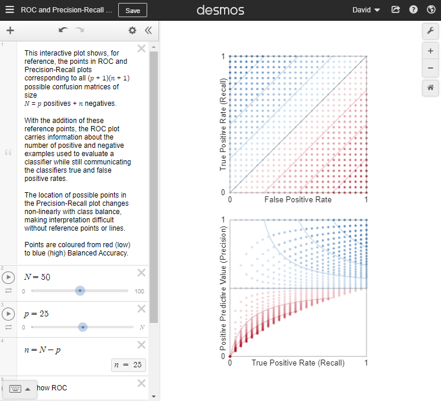
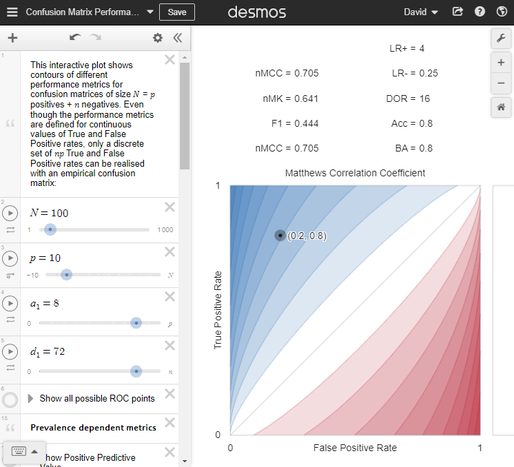
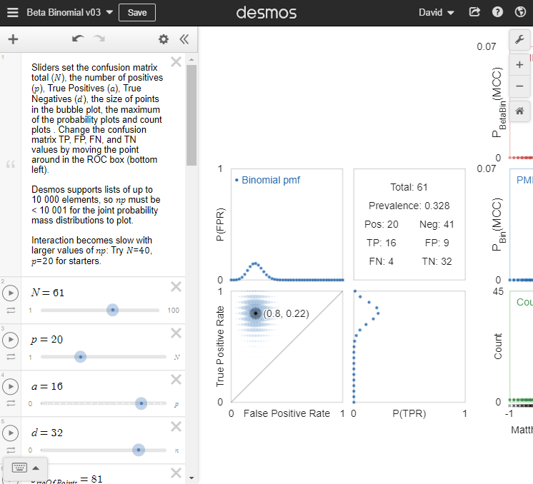

```{css, echo=FALSE}
/*
  This is used to enable right-floating figures in the HTML. See
  https://stackoverflow.com/questions/2062258/floating-elements-within-a-div-floats-outside-of-div-why
  https://bookdown.org/yihui/rmarkdown-cookbook/html-css.html
*/
span.clear { clear: right; display: block; }
```

# About this document

This document provides the RMarkdown behind the figures and interactive visualisations in our paper for anyone who wants to see how they were created or who wishes to extend them.

* Source code (Rmarkdown) is available from Github at [https://github.com/DavidRLovell/Never-mind-the-metrics](https://github.com/DavidRLovell/Never-mind-the-metrics)
* Some of these figures link to the [Desmos Graphing Calculator](https://www.desmos.com/)
  * Desmos automatically ensures that the underlying code is available to copy and develop further.

```{r setup, include=FALSE}
# Start with a clean environment
rm(list=ls())

knitr::opts_chunk$set(echo = TRUE, comment = NA)
library(tidyverse)
library(magrittr)
library(extraDistr)        # For beta-binomial distribution functions
library(plotly)            # for 3-D visualisation
library(RColorBrewer)
library(patchwork)         # for arranging figures
library(scales)
library(ggridges)

c.low  <- rgb(178/255,24/255,43/255)
```

# Generating confusion matrices

We begin by generating all possible confusion matrices of a given size. A confusion matrix comprises four non-negative integers and the sum of these is known as a _weak composition_. Here is a function to create all `k` element weak compositions of total `n`, based on code by [Michel Billaud](https://stackoverflow.com/a/69696615/1014385)

```{r function-makeAllWeakCompositions, echo=TRUE}
makeAllWeakCompositions <- function(n,k){
  # Initialise the matrix that will hold all compositions
  composition <- matrix(data=0, nrow=choose(n+k-1,k-1), ncol=k)
  
  composition[1,k]  <- n # Set the first composition (0,...,0,n)
  current.row       <- 1 # Set the current row to the first row
  last.nonzero      <- k # The last non-zero element of the current row is in position k
  
  # While the first element of the current row is less than n... 
  while(composition[current.row,1] < n){
    # generate the next row
    next.row <- current.row + 1
    # copy the current row into the next row
    composition[next.row,] <- composition[current.row,]
    # turn    a b ...   y   z 0 0 ...   0
    #                       ^ last
    # into    a b ... (y+1) 0 0 0 ... (z-1)
    
    last.nonzero                            <- max(which(composition[next.row,] > 0))
    z                                       <- composition[current.row, last.nonzero]
    composition[next.row, last.nonzero - 1] <- composition[current.row, last.nonzero - 1] + 1
    composition[next.row, last.nonzero    ] <- 0
    composition[next.row, k               ] <- z - 1
    current.row                             <- next.row
  }
  return(composition)
}
```

To demonstrate, here are the first six and the last six weak compositions of four elements that sum to 5
```{r}
makeAllWeakCompositions(5,4) %>% head()
makeAllWeakCompositions(5,4) %>% tail()
```

The number $C_k^{'}(n)$ of compositions of a number $n$ of length $k$ (where 0 is allowed) is given by ([Weisstein, n.d.](https://mathworld.wolfram.com/Composition.html)):

$$
\begin{align}
C_k^{'}(n) &= \binom{n+k-1}{k-1}\\
&=\frac{(n+k-1)!}{n!(k-1)!}
\end{align}
$$

so
$$
\begin{align}
C_4^{'}(0) &= `r choose(0 + 4 - 1, 4 - 1) `\\
C_4^{'}(1) &= `r choose(1 + 4 - 1, 4 - 1) `\\
C_4^{'}(2) &= `r choose(2 + 4 - 1, 4 - 1) `\\
C_4^{'}(3) &= `r choose(3 + 4 - 1, 4 - 1) `\\
C_4^{'}(4) &= `r choose(4 + 4 - 1, 4 - 1) `\\
C_4^{'}(5) &= `r choose(5 + 4 - 1, 4 - 1) `\\
&\vdots\\
C_4^{'}(100) &= `r choose(100 + 4 - 1, 4 - 1) `
\end{align}
$$

Now that we can generate all possible confusion matrices of a given total, we can augment them with various performance metrics.


# Adding performance metrics to confusion matrices


```{r function-MCC, echo=FALSE}
MCC <- function(TP, FP, FN, TN){
  MCC <- (TP*TN - FP*FN)/sqrt((TP+FP)*(TP+FN)*(TN+FP)*(TN+FN))
  MCC <- ifelse(
    is.finite(MCC), MCC,
    ifelse(
      (TP == 0 & FP == 0) | (TP == 0 & FN == 0) | (TN == 0 & FP == 0) | (TN == 0 & FN == 0),
      0,
      ifelse(
        (TP > 0 & FP + FN + TN == 0) | (TN > 0 & FP + FN + TP == 0),
        +1,
        -1)
    )
  )
  return(MCC)
}
```

```{r function-zdiv, echo=FALSE}
zdiv <- function(x,y){
  ifelse(
    x==0, 
    ifelse(y==0,NA,0),
    x/(x+y)
    )
} 
```

The following function returns a dataframe representing all possible confusion matrices of size `n`, projected into 3-dimensions with a range of performance metrics added as columns
```{r function-make.confmat, echo=TRUE}
make.confmat <- function(n) {
  # This matrix is used to project the four dimensional confusion matrix into three dimensions
  project3d <- matrix(
    c(
        0 ,   0 ,   1, # TP
        0 ,   1 ,   0, # FP
        1 ,   0 ,   0, # FN
      -1/3, -1/3, -1/3 # TN
    ), byrow = TRUE, nrow=4
  )
  
  makeAllWeakCompositions(n,4) -> abcd              # All confusion matrices of size n
  colnames(abcd) <- c("TP", "FP", "FN", "TN")       # with columns named after confusion matrix elements
  abcd %*% project3d           -> xyz               # ...projected into 3D
  colnames(xyz)  <- c("x", "y", "z")                # with columns named after the three dimensions
  bind_cols(as_tibble(abcd), as_tibble(xyz)) %>%    # ...bound side by side
    mutate(                                         # and augmented with...
      text       =sprintf("%2d %2d\n%2d %2d", TP,FP,FN,TN), # Label for plotly
      Pos        =TP+FN,                            # Number of actual positives
      Neg        =FP+TN,                            # Number of actual negatives
      TPR        =TP/Pos,                           # True Positive Rate
      FPR        =FP/Neg,                           # False Positive Rate
      PLR        =TPR/FPR,                          # Positive Likelihood Ratio (LR+)
      TNR        =TN/Neg,                           # True Negative Rate
      FNR        =FN/Pos,                           # False Negative Rate
      NLR        =FNR/TNR,                          # Negative Likelihood Ratio (LR-)
      DOR        =PLR/NLR,                          # Diagnostic Odds Ratio
      prior.O    =Pos/Neg,                          # Prior odds of actual class being X
      prior.P    =zdiv(Pos,Neg),                    # Prior prob of actual class being X
      post.O     =TP/FP,                            # Posterior odds that actual class is X
      post.P     =zdiv(TP,FP),                      # Posterior probability that actual class is X 
      prior.O.n  =Neg/Pos,                          # Prior odds of actual class NOT being X
      prior.P.n  =zdiv(Neg,Pos),                    # Prior prob of actual class NOT being X
      post.O.n   =TN/FN,                            # Posterior odds that actual class is NOT X 
      post.P.n   =zdiv(TN,FN),                      # Posterior probability that actual class is NOT X
      MCC        =MCC(TP,FP,FN,TN),                 # Matthews correlation coefficient
      logDOR     =log(DOR),                         # log of DOR
      #slogDOR    =logDOR/log((Pos-1)*(Neg-1)),     # scaled log of DOR
      J          =TPR + TNR - 1,                    # Youden's J, Balanced Accuracy
      Acc        =(TP+TN)/(Pos + Neg),              # Accuracy
      F1         =2*TP / (2*TP + FP + FN),          # F1
      Markedness =post.P + post.P.n - 1,            # Markedness
      g.mean     =sqrt(TPR * TNR),                  # Geometric mean
      Prev.Thresh=sqrt(FPR)/(sqrt(TPR)+sqrt(FPR)),  # Prevalence threshold
      Threat.Scr =TP / (TP + FN + FP),              # Threat score
      Fowlkes.M  =sqrt(post.P * TPR),               # Fowlkes-Mallows index
    ) 
  }
```

```{r make.confmats, echo=FALSE, warning=FALSE}
# Make some sets of confusion matrices that we will use later
make.confmat(60)  -> confmat.60
make.confmat(61)  -> confmat.61
make.confmat(100) -> confmat.100
make.confmat(101) -> confmat.101
```


# All possible ROC and Precision-Recall reference points
<div>
```{r, echo=FALSE, out.width= "50%", out.extra='style="float:right; padding:10px"'}

```

http://bit.ly/see-ROC-reference-points shows all possible $(p+1)\times(n+1)$ points in ROC and Precision-Recall spaces corresponding to confusion matrices of size $N = p+n$, coloured from red (low) to blue (high) Balanced Accuracy. Users can change $N$ and $p$ by adjusting the sliders in the left hand side of the Desmos window.

<span class="clear"></span>
</div>


# Confusion matrix performance metric contours
<div>
```{r, echo=FALSE, out.width= "50%", out.extra='style="float:right; padding:10px"'}
  
```

http://bit.ly/see-confusion-metrics enables us to interactively visualise a range of confusion matrix performance metrics by plotting their contours, coloured from red (low) to white (middle) to blue (high). 

Users can change $Nt$ and $p$ by adjusting the sliders in the left hand side of the Desmos window, and can set the position of a test point by adjusting the $a_1$ and $d_1$ sliders. There are many things that users can turn on and off by clicking on the small round circles at the left edge of the screen:

* **Contours of prevalence-dependent and prevalence independent metrics.** These switches are titled `Show Accuracy`, `Show MCC`, through to `Show Geometric Mean` and, when activated, display the contours of the chosen performance metrics
* **Additional information and decoration** switches allow users to show all possible ROC points; a movable test point whose corresponding confusion matrix and performance metric values can be displayed; and various titles. Importantly, users can toggle the limits of what is displayed, so that performance metric contours _beyond_ ROC space can be visualised.

<span class="clear"></span>
</div>


# Uncertainty in confusion matrices and their performance metrics

<div>
```{r, echo=FALSE, out.width= "50%", out.extra='style="float:right; padding:10px"'}
  
```

http://bit.ly/see-confusion-uncertainty enables interactive exploration of the posterior predictive pmfs of confusion matrices and three performance metrics (MCC, BA, $F_1$) under binomial and beta-binomial models of uncertainty. 

Users can change $N$ and $p$ by adjusting the sliders in the left hand side of the Desmos window, and can set the position of a test point by adjusting the $a$ and $d$ sliders. There are many things that users can turn on and off by clicking on the small round circles at the left edge of the screen:

* **Marginal and joint pmfs of True and False Positive rates.** Users can show these posterior predictive probability mass functions for confusion matrices of size $N=p+n$ under binomial and beta-binomial models of uncertainty, given that $a$ True Positives and $d$ True Negatives have been observed.
* **Posterior predictive pmfs of MCC, BA and $F_1$** can be shown using the `Show PMF...` switches for each performance metric. There are also switches to show the unique performance metric values (`Show rug...`), the number of times these unique values are observed (`Show count...`) and a histogram summary of the probability mass functions (`Show histogram...`).
* **Additional information and decoration** switches allow users to show all possible ROC points; a movable test point whose corresponding confusion matrix and performance metric values can be displayed; and various labels.
* **item[Axis and point size scales** are sliders that allow users to adjust the size of the points used in the joint pmf display, the maximum of the performance metric pmfs y-axis ($P_{max}$), and the maximum of the performance metric counts y-axis  ($C_{max}$).

<span class="clear"></span>

As noted on the visualisation, Desmos supports lists of up to $10\,000$ elements, so $np$ must be $< 10\,001$ for the joint probability mass distributions to plot. This visualisation runs in your web browser and interaction becomes slow with larger values of $np$: we recommend starting with $N=60, p=20$.

</div>


# Display an interactive confusion simplex

```{r function-plot.simplex, echo=FALSE}
# This convenience function plots the 3D projection of the confusion matrices in confmat
# coloured by metric
# for three different values of Pos
plot.simplex <- function(confmat, metric="MCC", Pos.vals=c(20, 50, 90)){
  # Pick out the extremes of the confusion simplex
  N <- max(confmat$TP)
  extremes <- filter(confmat, pmax(TP,FP,FN,TN) == N)
  edges    <- rbind(
    extremes,
    extremes[c(1,3,2,4),]
  )
  
  # Set up a colour scale that works for finite values of the chosen metric
  select(confmat, all_of(metric)) %>%
    filter(is.finite(.[[metric]])) %>% range() -> metric.range

  marker <- list(
    color=as.formula(paste("~", metric)),
    cmin=metric.range[1],
    cmax=metric.range[2],
    colorscale=list(
      seq(from=0, to=1, len=11), brewer.pal(11, "RdBu")
    ),
    colorbar=list(
      x=0, y=0.5, outlinewidth=0, len=0.5, title=list(text=metric)
    ),
    size=2, showscale=TRUE
  )
  
  # Set up the axes and annotations
  scene <- list(
    xaxis = list(visible=FALSE),
    yaxis = list(visible=FALSE),
    zaxis = list(visible=FALSE),
    annotations=list(
      list(x=N, y=000, z=000, showarrow=FALSE, text="TN", yanchor="top"),
      list(x=000, y=N, z=000, showarrow=FALSE, text="FP", yanchor="top"),
      list(x=000, y=000, z=N, showarrow=FALSE, text="TP", yanchor="bottom"),
      list(x=-N/3, y=-N/3, z=-N/3, showarrow=FALSE, text="FN", yanchor="top")
    )
  )
  
  # Create the plot
  plot_ly(
    # plot the finite values of the slice where Pos == Pos.vals[1]
    data=
      select(confmat, x, y, z, Pos, text, all_of(metric)) %>% 
      filter(Pos == Pos.vals[1], is.finite(.[[metric]])),
    type="scatter3d", mode="markers", name=sprintf("Pos==%d", Pos.vals[1]),
    x = ~x, y = ~y, z = ~z, marker=marker, text=~text, hoverinfo="text"
  ) %>% 
    add_trace(
    # plot the finite values of the slice where Pos == Pos.vals[2]
      data=select(confmat, x, y, z, Pos, text, all_of(metric)) %>% 
        filter(Pos == Pos.vals[2], is.finite(.[[metric]])),
      type="scatter3d", mode="markers", name=sprintf("Pos==%d", Pos.vals[2]),
      x = ~x, y = ~y, z = ~z, marker=marker, text=~text, hoverinfo="text"
    ) %>% 
    add_trace(
    # plot the finite values of the slice where Pos == Pos.vals[3]
      data=select(confmat, x, y, z, Pos, text, all_of(metric)) %>% 
        filter(Pos == Pos.vals[3], is.finite(.[[metric]])),
      type="scatter3d", mode="markers", name=sprintf("Pos==%d", Pos.vals[3]),
      x = ~x, y = ~y, z = ~z, marker=marker, text=~text, hoverinfo="text"
    ) %>% 
    # plot the edges of the confusion simplex
    add_trace(
      data=edges,  name="edges", mode="markers+lines",
      x=~x, y=~y, z=~z,  marker=list(showscale=FALSE), line=list(color="#DDDDDD")
    ) %>%
    # allow points to be interactively identified
    layout(
      hoverlabel=list(font=list(family = "monospace")),
      scene=scene
    )
}
```

The helper function `plot.simplex()` generates an interactive 3D visualisation of a confusion matrix, coloured by a chosen metric. Here it is used to provide 3D projections of binary confusion matrices of size 100. Each point corresponds to a unique confusion matrix and is coloured by the value of that matrix's Matthews Correlation Coefficient (MCC). For reference, we label the four extreme points corresponding to all True Positives, (TP=100), all False Negatives (FN=100), etc., and connect those vertices to give an impression of the regular tetrahedral lattice (i.e., the 3-simplex) of the projected points. In total, there are $\binom{100+4-1}{4-1}=176\,851$ different binary confusion matrices of size 100. Rather than show all these, we have taken three slices through the lattice: from back to front, the rectangular lattices of points correspond to confusion matrices where $p = 20, 50, 90$, respectively.

```{r echo=TRUE}
plot.simplex(confmat.100, metric="MCC")
```

Mouse over the tetrahedron, then click and drag to change its orientation. Click on the text `Pos==20` to toggle that slice of the confusion matrix.

Here is the same confusion simplex, this time, coloured by Accuracy.

```{r echo=TRUE}
plot.simplex(confmat.100, metric="Acc")
```


# Plot the contours of MCC in ROC space

Here is a confusion matrix representing $N=a+b+c+d$ examples
$$
\begin{bmatrix}
\mathrm{TP} & \mathrm{FP}\\
\mathrm{FN} & \mathrm{TN}
\end{bmatrix}=
\begin{bmatrix}
a & b\\
c & d
\end{bmatrix}
$$
in which there are $p=a+c$ actual positives and $n=b+d$ actual negatives.

The Matthews Correlation Coefficient is defined to be
$$
\begin{align}
    \mathrm{MCC}(a, b, c, d)
    &=\frac{ad-bc}{\sqrt{(a+b)(a+c)(b+d)(c+d)}}\\
    &=\frac{ad-(n-d)(p-a)}{\sqrt{(a+n-d)pn(p-a+d)}}.
\end{align}
$$

For given numbers of positives ($p$) and negatives ($n$), this performance metric achieves a value of $-1 \leq k \leq 1$ along the contour lines with
$$
a(k, p, n, d) =
\left\{
\begin{array}{ c l }
\frac{1}{2 (k^2 p + n)}
\left( 
  +\sqrt{
    \frac
      {k^2 p (n + p)^2 (4d(n-d) + k^2 n p)}
      {n}
  } + 
  2dp(k^2 - 1) + k^2p(p - n) + 2np
\right), & k \geq 0\\
\frac{1}{2 (k^2 p + n)}
\left( 
  -\sqrt{
    \frac
      {k^2 p (n + p)^2 (4d(n-d) + k^2 n p)}
      {n}
  } + 
  2dp(k^2 - 1) + k^2p(p - n) + 2np
\right), & k < 0
\end{array}
\right.
$$


```{r echo=FALSE}
# The following function produces the TP values ($a$) for the contour value $k \in [-1, 1]$),
# given a particular number of positives $p$ and negatives $n$ and true negatives ($d$)
MCC.contour <- function(k, p, n, d){
  ifelse(
    k>0,
    ifelse(
      d < k^2 * n * (p + n) / (p + k^2 * n),
      NA, # Clip the contour at a = p
      0.5/(k^2 * p + n) * (
        sqrt(
          (k^2 * p * (n+p)^2 * (-4*d^2 + 4 * d * n + k^2 * n * p))/n
        ) +
          2 * d * k^2 * p -
          2 * d * p -
          k^2 * n * p +
          k^2 * p^2  + 
          2 * n * p
      )
    ),
    ifelse(
      d > -(k^2 - 1) * n * p / (p + k^2 * n),
      NA, # Clip the contour at a = 0
      0.5/(k^2 * p + n) * (
        -sqrt(
          (k^2 * p * (n+p)^2 * (-4*d^2 + 4 * d * n + k^2 * n * p))/n
        ) +
          2 * d * k^2 * p -
          2 * d * p -
          k^2 * n * p +
          k^2 * p^2  + 
          2 * n * p
      )
    )
  )
}
```

```{r echo=FALSE}
p <- 20
n <- 80
```

```{r echo=FALSE}
expand.grid(
  k=seq(from=-0.9, to=0.9, by=0.1),
  p=p,
  n=n,
  d=seq(from=0, to=n, by=0.5)) %>%
  as_tibble() %>%
  mutate(a=MCC.contour(k, p, n, d)) %>%
  na.omit()   -> MCC.contours
```

To illustrate these contours in ROC space, here is an orthographic projection of the slice  of points from the confusion simplex shown above where $p=20$ and $n=80$, coloured by the value of the Matthews Correlation Coefficient (MCC). The continuous lines indicate the contours of MCC, ranging from $-0.9, -0.8, \dots, 0.9$. Note that while MCC  can be calculated for continuous arguments, empirical confusion matrices give rise to a finite set of $(p+1)\times(n+1)$ arguments, corresponding to the points in this 2D lattice.

```{r echo=FALSE}
size <- 0.5

ggplot(data=filter(confmat.100, Pos==p), aes(x=n-TN, y=TP)) + 
  geom_point(aes(colour=MCC), size=size) +
  scale_colour_gradient2() +
  geom_line(data=MCC.contours, aes(x=n-d, y=a, group=k, colour=k), size=size) +
  coord_equal(expand = FALSE) +
  labs(caption="(a)", x="False Positives", y="True Positives") +
  theme(
    legend.position = "none",
    plot.caption = element_text(hjust = 0, family= "serif", size = 18)
    ) -> p1
p1
```

...and here are the same points and contours scaled to fit within the ROC space. ROC curves plot a classifier's true positive _rate_ against its false positive _rate_ in the space of rational numbers from $[0,1]\times[0,1]$. This is equivalent to re-scaling the $x$-axis of (a) by a factor of $\tfrac1n$ and the $y$-axis by $\tfrac1p$. Again, the contours of the MCC performance metric are defined continuously, but empirical confusion matrices can only take on values at the discrete points in this plot which have $n+1=81$ possible $x$-values $(0, \tfrac1n, \tfrac2n, \dots, 1)$ and $p+1=21$ possible $y$-values $(0, \tfrac1p, \tfrac2p, \dots, 1)$.

```{r echo=FALSE}
ggplot(data=filter(confmat.100, Pos==20), aes(x=(n-TN)/n, y=TP/20)) + 
  geom_point(aes(colour=MCC), size=size) +
  scale_colour_gradient2() +
  geom_line(data=MCC.contours, aes(x=(n-d)/n, y=a/20, group=k, colour=k), size=size) +
  coord_equal(expand = FALSE) +
  scale_x_continuous(breaks=0:1) +
  scale_y_continuous(breaks=0:1) +
  labs(caption="(b)", x="False Positive Rate", y="True Positive Rate")  +
  theme(
    legend.position = c(0.95, 0.95), legend.justification = c(1,1),
    plot.caption = element_text(hjust = 0, family= "serif", size = 18)
    ) -> p2
p2
```

```{r eval=FALSE, echo=FALSE}
p1 + p2 #+ plot_annotation(tag_levels = 'a', tag_prefix = '(', tag_suffix = ')')
ggsave("plots/slice.pdf", width=10*1.1, height=3*1.1)
```

# Where do different ROC points have the same performance metric value?

```{r function-J.contour, echo=FALSE}
# Youden's J is the same as Balanced Accuracy
J.contour <- function(k, p, n, d){
  a <- p * (k - d/n + 1)
  return(
    ifelse(a > p | a < 0, NA, a)
  )
}
```

```{r function-F1.contour, echo=FALSE}
F1.contour <- function(k, p, n, d){
  a <- k *(d - n - p)/(k - 2)
  return(
    ifelse(a > p | a < 0, NA, a)
  )
}
```

```{r echo=FALSE}
expand.grid(
  k=seq(from=-0.9, to=0.9, by=0.1),
  p=20,
  n=40,
  d=seq(from=0, to=40, by=0.25)) %>%
  as_tibble() -> contour.60.points

expand.grid(
  k=seq(from=-0.9, to=0.9, by=0.1),
  p=20,
  n=41,
  d=seq(from=0, to=41, by=0.25)) %>%
  as_tibble() -> contour.61.points

bind_rows(
  mutate(contour.60.points,              a=MCC.contour(k, p, n, d), metric="MCC", total=60),
  mutate(contour.60.points,              a=  J.contour(k, p, n, d), metric="BA",  total=60),
  mutate(contour.60.points,  a= F1.contour((k+1) / 2, p, n, d), metric="F1",  total=60),
  mutate(contour.61.points,              a=MCC.contour(k, p, n, d), metric="MCC", total=61),
  mutate(contour.61.points,              a=  J.contour(k, p, n, d), metric="BA",  total=61),
  mutate(contour.61.points,  a= F1.contour((k+1) / 2, p, n, d), metric="F1",  total=61)
) %>%  na.omit()  %>%
    mutate(metric=fct_relevel(metric, "MCC", "BA", "F1")) -> metric.contours
```

Each panel shows all the possible points in the ROC space of confusion matrices of 20 positive and 40 negative examples (top row) and 20 positive and _41_ negative examples (bottom row). Points are coloured by the number of times the performance metric value at that point is observed in the confusion matrices of those totals. Three different performance metrics are presented: MCC (left), BA (middle), $F_1$ (right). Performance metric contours are shown in the background, coloured by their value. Note that one additional negative example changes the configuration of possible points in ROC space so that each possible MCC and BA value is unique (bottom left and middle); the multiplicity of different $F_1$ values remains much the same. (bottom right).

```{r echo=FALSE, warning=FALSE}
filter(confmat.60, Pos==20) %>% select(Pos, Neg, TPR, TNR, MCC, J, F1) %>% mutate(BA=(J+1)/2) -> confmat.60.metrics
filter(confmat.61, Pos==20) %>% select(Pos, Neg, TPR, TNR, MCC, J, F1) %>% mutate(BA=(J+1)/2) -> confmat.61.metrics
bind_rows(
  confmat.60.metrics %>% add_count(MCC) %>% mutate(metric="MCC"),
  confmat.60.metrics %>% add_count(BA)  %>% mutate(metric="BA"),
  confmat.60.metrics %>% add_count(F1)  %>% mutate(metric="F1"),
  confmat.61.metrics %>% add_count(MCC) %>% mutate(metric="MCC"),
  confmat.61.metrics %>% add_count(BA)  %>% mutate(metric="BA"),
  confmat.61.metrics %>% add_count(F1)  %>% mutate(metric="F1")
) %>% 
  filter(is.finite(n)) %>%
  mutate(
    total=Pos+Neg,
    count=cut(n,breaks=c(0, 2^(0:8)), labels=c("1", "2", "3-4", "5-8", "9-16", "17-32", "33-64", "65-128", "129-256")),
    metric=fct_relevel(metric, "MCC", "BA", "F1")
) %>%
  ggplot(aes(x=1-TNR, y=TPR)) +
  scale_color_gradient2(labels=NULL,name="value") +
  scale_fill_brewer(palette = "Greens") + 
  scale_size_discrete(range=c(0.1,1.8)) +
  geom_line(data=filter(metric.contours, total==60), aes(x=(40-d)/40, y=a/20, group=k, colour=k)) +
  geom_line(data=filter(metric.contours, total==61), aes(x=(41-d)/41, y=a/20, group=k, colour=k)) +
  geom_point(aes(fill=count,size=count), shape=21, colour="grey80", alpha=0.6) +
  xlab("FPR") + 
  scale_x_continuous(breaks=0:1) +   scale_y_continuous(breaks=0:1) +
  coord_equal() +
  facet_grid(total ~ metric, labeller = label_both)
```


```{r echo=FALSE, eval=FALSE}
ggsave("plots/counts.pdf", width=8.57*1.1, height=5.48*1.1)
```

# Visualising the joint probability mass function of TP and TN

Here are two ways to show confusion matrix pmfs and performance metric contours in ROC space. Both plots show the posterior predictive pmf of confusion matrices under a beta-binomial model of uncertainty for a classifier observed to produce the confusion matrix 
$$\begin{bmatrix}16&8\\4&32\end{bmatrix}$$ The left plot uses circle areas to represent probability mass; the right plot uses ridge lines. In the background are the contours of the $F_1$ performance metric and in black are the contours $F_1=\tfrac{4}{10}$ and $F_1=\tfrac{2}{3}$, along each of which lie 11 points in ROC space.

```{r function-conf.bbd, echo=FALSE}

conf.bbd <- function(
  TP=16, FP=08, 
  FN=04, TN=32
  ){
  Pos <- TP + FN
  Neg <- FP + TN
  
  outer(
    dbbinom(0:Pos, size=Pos, alpha=TP+1, beta=FN+1),
    dbbinom(0:Neg, size=Neg, alpha=TN+1, beta=FP+1)
  ) %>%
    as.data.frame.table() %>%
    as_tibble() %>%
    mutate_if(is.factor, as.integer) %>% 
    mutate(TP=Var1 - 1, TN=Var2 - 1, FP=Neg-TN, FN=Pos-TP) %>%
    rename(Probability=Freq) %>%
    select(TP, FP, FN, TN, Probability)
}
```

```{r echo=FALSE, warning=FALSE, message=FALSE}
m <-1
conf.bbd(
  TP=16*m, FP=08*m, 
  FN=04*m, TN=32*m
) -> C

filter(confmat.60, Pos==20) %>% select(TP, FP, F1) %>% add_count(F1) %>% filter(n==11) -> confmat.60.F1.11

left_join(confmat.60.F1.11, C, 'TP'='TP', 'FP'='FP') -> confmat.60.F1.11.P
# unique(confmat.60.F1.11.P$F1)

expand.grid(
  k=unique(seq(from=-0.9, to=0.9, by=0.1),confmat.60.F1.11.P$F1),
  p=20,
  n=40,
  d=seq(from=0, to=40, by=0.25)) %>%
  as_tibble() %>%
  mutate(a= F1.contour((k+1) / 2, p, n, d), b=40-d) %>% 
  na.omit() -> confmat.60.F1.contour
```

```{r echo=FALSE}
ggplot(data=C, aes(x=FP, y=TP)) + 
  geom_line(data=confmat.60.F1.contour, aes(x=b, y=a, group=k, colour=k)) +
  scale_size_area(max_size=5) +
  geom_point(aes(size=Probability), alpha=0.5, color=c.low) + 
  geom_line(data=confmat.60.F1.11.P, aes(x=FP,  y=TP, group=F1))+
  geom_point(data=confmat.60.F1.11.P, aes(size=Probability)) +
  coord_fixed(ratio=41/21)  +
  theme(legend.position = "none") +
  scale_colour_gradient2()  -> p1

max.prob <- max(C$Probability) # ...so the same scale is applied to C and confmat.60.F1.11.P
ggplot(data=C, aes(x=FP, y=TP,  group=TP)) + 
  geom_line(data=confmat.60.F1.contour, aes(x=b, y=a, group=k, colour=k)) +
  geom_line(data=confmat.60.F1.11.P, aes(x=FP,  y=TP, group=F1))+
  geom_point(aes(x=FP, y=TP+Probability/max.prob), size=1, alpha=0.5, color=c.low) +
  geom_density_ridges(
    aes(height=Probability), stat = "identity", scale = 1, color=c.low, fill=c.low, alpha=0.5
  ) +
  geom_segment(
    data=confmat.60.F1.11.P, 
    aes(x=FP, xend=FP, y=TP, yend=TP+Probability/max.prob)
  ) +
  geom_point(
    data=confmat.60.F1.11.P, 
    aes(x=FP,  y=TP+Probability/max.prob), size=1
  ) +
  scale_colour_gradient2() +
  coord_fixed(ratio=41/21) + ylab("") +
    theme(legend.position = "none") -> p2

p1 + p2
```

```{r echo=FALSE, eval=FALSE}
ggsave("plots/pmfs.pdf", width=8.57*1.1, height=5.48*1.1)
```

# Visualising how uncertainty changes with more data

Reducing uncertainty in performance metrics requires more data to increase the precision of the predictive distribution of confusion matrices. These four contour plots show the posterior predictive pmfs (under a beta-binomial model of uncertainty) after observing confusion matrices of increasing size but with the same false and true positive rates (0.2, 0.8). From left to right, the sizes of confusion matrix increase by a factor of 4 and the heights and widths of the contours decrease by a factor of $\tfrac{1}{2}$.

```{r echo=FALSE}
plot.ddbinom.contour <- function(TP=16, FP=8, FN=4, TN=32, m=1){
  TP <- TP * m; FP <- FP *m
  FN <- FN * m; TN <- TN *m
  
  Pos <- TP+FN
  Neg <- FP+TN
  conf.bbd(TP, FP, FN, TP)  %>%
    filter(Probability > 1e-7) %>%
    ggplot(aes(x=FP, y=TP, height=Probability)) + 
    geom_hline(yintercept=TP, lty=2) +
    geom_vline(xintercept=FP, lty=2) +
    geom_contour(aes(z=Probability,colour=after_stat(level))) +
    geom_contour(aes(z=Probability), colour=c.low) +
    coord_fixed(ratio=(Neg+1)/(Pos+1), xlim=c(0,Neg), ylim=c(0,Pos), expand=TRUE) +
    labs(title=sprintf("N = %d",Pos+Neg), subtitle = sprintf("p + n = %d + %d",Pos,Neg),
         caption=sprintf("TP=%d FP=%d\nFN=%d TN=%d", TP, FP, FN, TP)) +
    theme(legend.position = "none")
}
```

```{r echo=FALSE}
plot.ddbinom.contour(m=001)            -> p1
plot.ddbinom.contour(m=004) + ylab("") -> p4
plot.ddbinom.contour(m=016) + ylab("") -> p16
plot.ddbinom.contour(m=064) + ylab("") -> p64

p1 +  p4 + p16 + p64 +  plot_layout(nrow=1)
```

```{r echo=FALSE, eval=FALSE}
ggsave("plots/pmfs.by.N.pdf", width=9, height=3)
```


